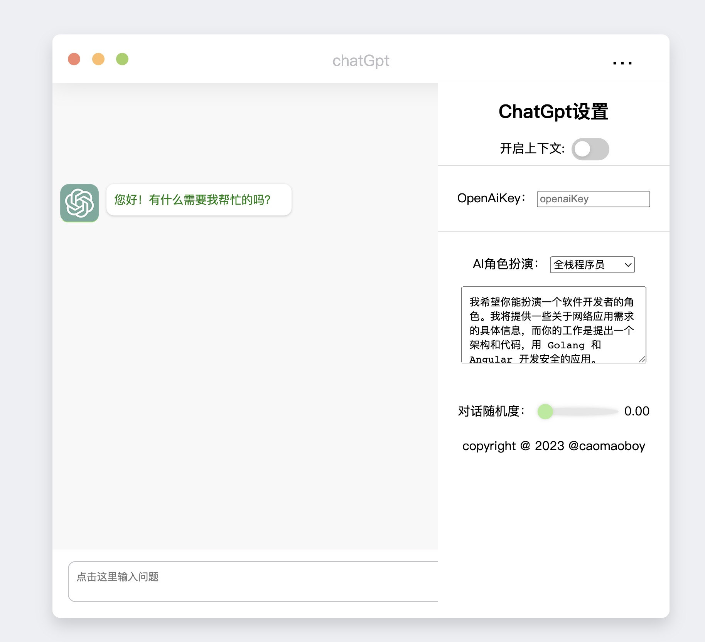

# gochat
chatgpt web use golang + html like wechat

This is a readme.md file for an open-source project on GitHub that uses Golang environment and Gomod for package management. To initialize, use "go mod tidy". To compile, use "go build". For the front-end, the project uses HTML and JS.Need redis Save context use Redis

To Start Project

> go mod tidy
>
> go build
>
>./goChat

Visit Page : 127.0.0.1:8080

 